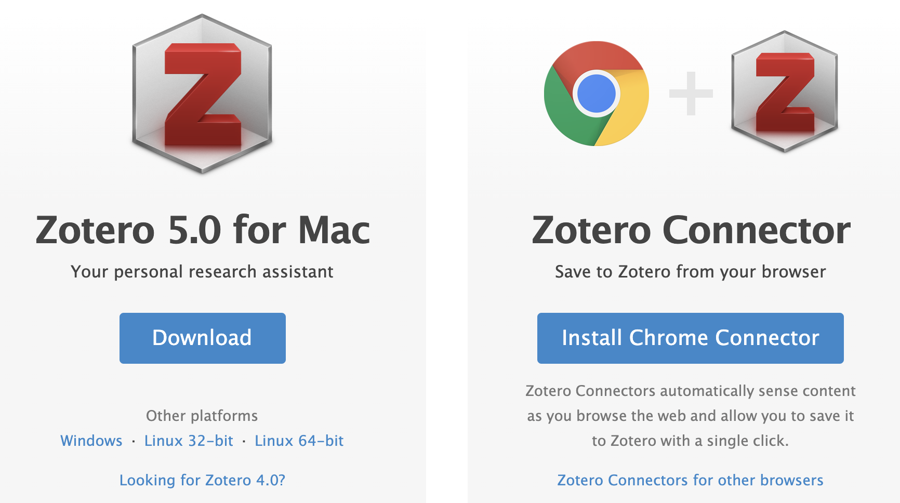
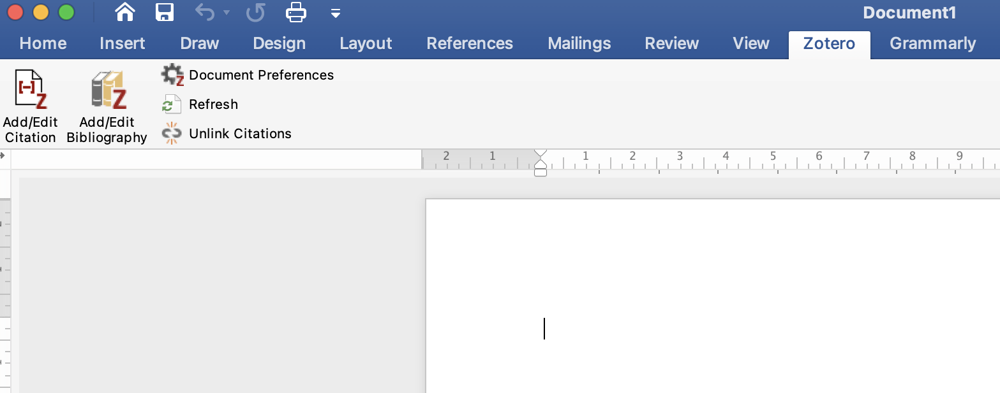
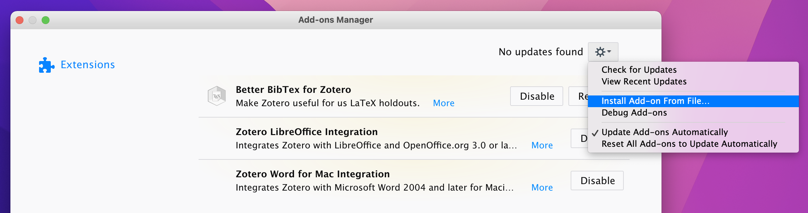

```{r setup, include=FALSE}
options(htmltools.dir.version = FALSE)
knitr::opts_chunk$set(collapse = TRUE,
                      fig.retina = 3,
                      echo = FALSE)
library(countdown)
library(ymlthis)
library(tidyverse)
library(magick)
library(icon)
library(xaringanExtra)
xaringanExtra::use_tachyons()
xaringanExtra::use_tile_view()
xaringanExtra::use_webcam()
xaringanExtra::use_fit_screen()
xaringanExtra::use_extra_styles(hover_code_line = TRUE, mute_unhighlighted_code = TRUE)
xaringanExtra::use_share_again()

```

layout: true

---

class: title-slide, center, middle, hide-count

background-image: url("https://images.unsplash.com/photo-1552385430-53e6f2028760?ixlib=rb-1.2.1&ixid=MnwxMjA3fDB8MHxwaG90by1wYWdlfHx8fGVufDB8fHx8&auto=format&fit=crop&w=774&q=80")
background-size: contain
background-position: right

```{r meta, echo=FALSE}
library(metathis)
meta() %>%
  meta_general(
    description = "Ajay Koli - Vishwakarma University",
    generator = "xaringan and remark.js"
  ) %>% 
  meta_name("github-repo" = "koliajaykr/plagiarism-zotero") %>% 
  meta_social(
    title = "Effective Citation & Referencing to avoid Plagiarism",
    url = "https://plag-zotero.netlify.app/",
    image = "https://plag-zotero.netlify.app/images/social-card.png",
    og_type = "talk",
    og_author = "Ajay Koli",
    twitter_card_type = "summary_large_image",
    twitter_creator = "@ajay_kolii"
  ) %>%
  include_meta()
```


# .left[`r rmarkdown::metadata$title`]

## .left.orange[`r rmarkdown::metadata$subtitle`]

### .left[`r rmarkdown::metadata$author` <br> `r format(Sys.Date(), "%d %B %Y") `]

---

class: middle, center

background-image: url("https://images.unsplash.com/photo-1552385430-53e6f2028760?ixlib=rb-1.2.1&ixid=MnwxMjA3fDB8MHxwaG90by1wYWdlfHx8fGVufDB8fHx8&auto=format&fit=crop&w=774&q=80")
background-size: contain
background-position: right

.pull-left[
## “If I have seen further, <br>it is by standing on the <br>shoulders of giants.”

### (Newton, 1675) 

.footnote.left[
Quote source: [fs](https://fs.blog/shoulders-of-giants/])

Image credit: [Angela Compagnone](https://images.unsplash.com/photo-1552385430-53e6f2028760?ixlib=rb-1.2.1&ixid=MnwxMjA3fDB8MHxwaG90by1wYWdlfHx8fGVufDB8fHx8&auto=format&fit=crop&w=987&q=80)
]

---

class: center, middle

.green["Gah. Not all resolved. I still didn’t have an argument. I couldn’t just report data analysis and X. I had to say what X and our data together meant for how we thought differently about X.] 
--
.blue[ And so what! The paper had to take the reader somewhere.] 
--
.red[I had to find an angle that would be of interest to the journal readers, and would actually advance the conversation that had gone on."] 

.footnote[
Source: [patter](https://patthomson.net/2021/02/01/writing-for-publication-finding-an-angle-and-an-argument/)
]


---

class: middle

background-image: url("https://images.unsplash.com/photo-1552385430-53e6f2028760?ixlib=rb-1.2.1&ixid=MnwxMjA3fDB8MHxwaG90by1wYWdlfHx8fGVufDB8fHx8&auto=format&fit=crop&w=774&q=80")
background-size: contain
background-position: right

## “If I have seen further, <br>it is by standing on the <br>shoulders of giants.”

### (Newton, 1675) 

- .green[find an argument/angle]

--

- .blue[so what?]

--

- .red[advance the conversation]

---

# Citation

- "citing sources allows scholars to .b[give credit] to other scholars for their .b[hard work and their ideas]"

--

- "by citing sources, scholars provide a .b[roadmap for readers] who are interested in learning more about a topic and joining the .b[ongoing conversation] about that topic"

.footnote[
Source: [Harvard University](https://usingsources.fas.harvard.edu/avoiding-plagiarism)
]

---

# Plagiarism `r emo::ji("rotating_light")`

- ".red[stealing] someone else’s work and passing it off as your own"<sup>*</sup>

--

- "Plagiarism is defined as the act of either .b[intentionally OR unintentionally] submitting work that was written by someone else. ... or if you turn in a paper in which you have copied material from any source .b[without citing that source], you are guilty of plagiarizing."<sup>**</sup>

--

- "Note that changing someone else's words around or merely substituting .b[synonyms] for their words is still plagiarism."<sup>$</sup>

.footnote[
[*] [patter](https://patthomson.net/2021/09/13/recycling-your-thesis-text-is-it-self-plagiarism/)

[**] [Harvard University](https://usingsources.fas.harvard.edu/avoiding-plagiarism)

[$] [Elmira College](https://libguides.elmira.edu/research/avoid_plagiarism)
]

---

class: middle, hide-count

# .center.i[sing your fav songs]

```{r fig.align='center'}
knitr::include_graphics("https://media0.giphy.com/media/JPn6ZSC6xTppwyv2iY/giphy.gif?cid=ecf05e47ek9evmhkx96f2udd1eq8ffpxe0htgib09zyddizv&rid=giphy.gif&ct=g")
```

`r countdown(minutes = 00, seconds = 30)`

---

# How to Avoid Plagiarism

- Keep track of your sources; print electronic sources

  - complete URL & date
  - check URL before submission

--

- Keep sources in correct context

  - unbiased

--

- Don't cut and paste: File and label your sources

  - separate file with date (2021-12-29-belk.doc)
  
--
  
- Keep your own writing and your sources separate

.footnote[
Source: [Harvard College Writing Program](https://usingsources.fas.harvard.edu/how-avoid-plagiarism)
]

---

# How to Avoid Plagiarism

- Keep your notes and your draft separate

--

- Paraphrase carefully in your notes; acknowledge your sources explicitly when paraphrasing
  
  - separate notes from draft
  
--

- Don't save your citations for later

--

- Always use quotation marks for directly quoted material, even for short phrases and key terms.  

.footnote[
Source: [Harvard College Writing Program](https://usingsources.fas.harvard.edu/how-avoid-plagiarism)
]

---
class: hide-count

# Effective Citation:

- Invite important people to the party (literature) and then allow them to speak

--

- Cite papers from the journal where you are planning to publish

--

- Use a good reference management tool like [Zotero](https://www.zotero.org/) `r emo::ji("sunglasses")`

--

- Include possible latest papers

```{r out.width="45%", fig.align='right'}
knitr::include_graphics("https://pbs.twimg.com/media/FFrkQJtVQAI7yTW?format=jpg&name=900x900")
```

.footnote[
Image source: [@JazliAziz](https://twitter.com/JazliAziz/status/1466735597125390336/photo/1)
]


---
class: inverse, hide-count, center, middle

background-image: url("https://localist-images.azureedge.net/photos/723905/original/25d3b1bf915e07897876757209f1c07db60c267f.png")
background-size: 50%
background-position: 50% 50%

---

background-image: url("https://localist-images.azureedge.net/photos/723905/original/25d3b1bf915e07897876757209f1c07db60c267f.png")
background-size: 22%
background-position: 99% -1%

# Zotero

- "Zotero is a free, easy-to-use tool to help you collect, organize, cite, and share research."

--

```{r zotero, out.width="70%", fig.align='center'}
knitr::include_graphics("https://www.zotero.org/static/images/home/screenshot-1.4@2x.png")
```

---

# Zotero

- Download and create log-in from here https://www.zotero.org/

```{r zotero-dwn, out.width="70%", fig.align='center'}

```

---

# Word Processor Plugins

- `r emo::ji("television")` watch how to use zotero with MS word https://www.youtube.com/watch?v=RuRF8zxkxIo#!

<br>

```{r word-doc, out.width="80%", fig.align='center'}

```


---


# Using Zotero with Google Docs

- how to do it blog post https://www.zotero.org/support/google_docs

```{r gog-doc, out.width="80%", fig.align='center'}
knitr::include_graphics("https://www.zotero.org/support/_media/google-docs-menu.png?w=400&tok=55835d")
```

---

# Better BibTeX for Zotero

- download from here https://retorque.re/zotero-better-bibtex/

- download `zotero-better-bibtex-5.6.10.xpi` file

- 'Tools' -> 'Addons' in Zotero, clicking the gear icon, and selecting 'Install Add-on From File'

```{r gear, out.width="80%", fig.align='center'}

```

---
class: center, middle, hide-count

.pull-left[
<blockquote class="twitter-tweet"><p lang="en" dir="ltr">how dare you mouse pad 🤪😂<a href="https://twitter.com/AcademicChatter?ref_src=twsrc%5Etfw">@AcademicChatter</a> <a href="https://t.co/fdYB0WewdY">pic.twitter.com/fdYB0WewdY</a></p>&mdash; Dr Ajay Koli (@ajay_kolii) <a href="https://twitter.com/ajay_kolii/status/1465215998340993026?ref_src=twsrc%5Etfw">November 29, 2021</a></blockquote> <script async src="https://platform.twitter.com/widgets.js" charset="utf-8"></script> 

]

.pull-right[

```{r ajay, out.width="40%", fig.align='center'}

```

`r icon::fa("link")` [R4Bee](https://r4b.netlify.app/)

`r icon::fa("twitter")` [@ajay_kolii](https://twitter.com/ajay_kolii)

`r icon::fa("envelope")`   [koliajaykumar@gmail.com](koliajaykumar@gmail.com)

# Thank you `r emo::ji("blush")`
]